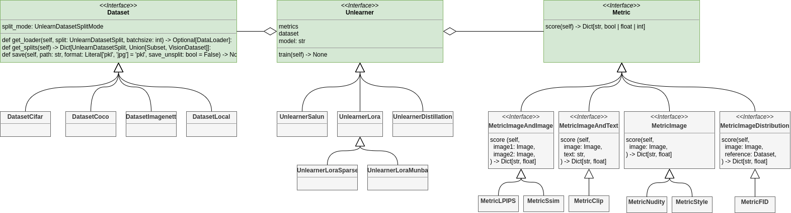

# Vision Unlearning

<!--  -->

<!-- Seperate batches for 3 tests-->


[Documentation](https://vision-unlearning.readthedocs.io/)

## Installation

```sh
pip install vision-unlearning
```

Compatible with python 3.10 to 3.12.

## What is Vision Unlearning?

Vision Unlearning provides a standard interface for unlearning algorithms, datasets, metrics, and evaluation methodologies commonly used in Machine Unlearning for vision-related tasks, such as image classification and image generation.

It bridges the gap between research/theory and engineering/practice, making it easier to apply machine unlearning techniques effectively.

Vision Unlearning is designed to be:
- Easy to use
- Easy to extend
- Architecture-agnostic
- Application-agnostic

## Who is it for?

### Researchers
For Machine Unlearning researchers, Vision Unlearning helps with:
- Using the same data splits as other works, including the correct segmentation of forget-retain data and generating data with the same prompts.
- Choosing the appropriate metrics for each task.
- Configuring evaluation setups in a standardized manner.

### Practitioners
For practitioners, Vision Unlearning provides:
- Easy access to state-of-the-art unlearning algorithms.
- A standardized interface to experiment with different algorithms.

## Tutorials
* [Replace _George W. Bush_ by _Tony Blair_ using FADE](https://colab.research.google.com/drive/1w_86jyZJfyY6YwOMUGbo9VoaJytqn3hz?usp=sharing)
* [Forget cat using UCE (with hyperparam tunning)](https://colab.research.google.com/drive/1Ma5_zP9iErU7du7Ev7a61Do2bS-EcZCj?usp=sharing)
* [Forget church using Munba](https://colab.research.google.com/drive/1eyjrNMcYi0PK37U0ZLcwydy153yiJUJ9?usp=sharing)
The source code for these tutorials is in `tutorials/`, but their outputs were cleaned to avoid burdening the repo.
The links above contain Google Drive stored executions with the full outputs.

For developers: every time there is a relevant modification in the codebase, please run the affected tutorials, save the notebook to Drive, clear the output before commiting.

## Main Interfaces

Vision Unlearning standardizes the following components:

- **Metric**: Evaluates a model (e.g., FID, CLIP Score, MIA, NudeNet, etc.).
- **Unlearner**: Encapsulates the unlearning algorithm.
- **Dataset**: Encapsulates the dataset, including data splitting.

Additionally, common tasks and evaluation setups are provided as example notebooks. Several platform integrations, such as Hugging Face and Weights & Biases, are also included.


