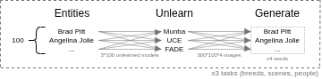

# Vision Unlearning

<!--  -->

<!-- Seperate batches for 3 tests-->


[Documentation](https://vision-unlearning.readthedocs.io/)

## Installation

```sh
pip install vision-unlearning
```

Compatible with python 3.10 to 3.12.

## What is Vision Unlearning?

Vision Unlearning provides a standard interface for unlearning algorithms, datasets, metrics, and evaluation methodologies commonly used in Machine Unlearning for vision-related tasks, such as image classification and image generation.

It bridges the gap between research/theory and engineering/practice, making it easier to apply machine unlearning techniques effectively.

Vision Unlearning is designed to be:
- Easy to use
- Easy to extend
- Architecture-agnostic
- Application-agnostic

## Who is it for?

### Researchers
For Machine Unlearning researchers, Vision Unlearning helps with:
- Using the same data splits as other works, including the correct segmentation of forget-retain data and generating data with the same prompts.
- Choosing the appropriate metrics for each task.
- Configuring evaluation setups in a standardized manner.

### Practitioners
For practitioners, Vision Unlearning provides:
- Easy access to state-of-the-art unlearning algorithms.
- A standardized interface to experiment with different algorithms.

# Tutorials

* [Replace _George W. Bush_ by _Tony Blair_ using FADE](https://colab.research.google.com/drive/1ZJG9By4_u1Vqy_SYelxfzUUImRzayRYw?usp=sharing)
* [Replace _George W. Bush_ by _Tony Blair_ using FADE sparse-per-module](https://colab.research.google.com/drive/1luM3kAoaBLoTwcsDcW3KO_SIiuIbwmWY?usp=sharing)
* [Replace _George W. Bush_ by _Tony Blair_ using FADE sparse-per-weigth](https://colab.research.google.com/drive/1ry5xXOPMuVm_LA_4Uyk27Aqe52L607kO?usp=sharing)
* [Forget cat using UCE (with hyperparam tunning)](https://drive.google.com/file/d/1OZtNkntOj-dVpo-T1kQdPMK7TMYX3ctf/view?usp=sharing)
* [Forget church using Munba](https://colab.research.google.com/drive/1eyjrNMcYi0PK37U0ZLcwydy153yiJUJ9?usp=sharing)

The source code for these tutorials is in `tutorials/`, but their outputs were cleaned to avoid burdening the repo.
The links above contain Google Drive stored executions with the full outputs.

For developers: every time there is a relevant modification in the codebase, please run the affected tutorials, save the notebook to Drive, clear the output before commiting.

# Main Interfaces

Vision Unlearning standardizes the following components:

- **Metric**: Evaluates a model (e.g., FID, CLIP Score, MIA, NudeNet, etc.).
- **Unlearner**: Encapsulates the unlearning algorithm.
- **Dataset**: Encapsulates the dataset, including data splitting.

Additionally, common tasks and evaluation setups are provided as example notebooks. Several platform integrations, such as Hugging Face and Weights & Biases, are also included.


# Evaluation

## Testbeds

Our testbeds serve as "meta benchmarks", a set of tasks that can be used as starting point when designing a new assessment, benchmark, or intervention. The several tasks are divided in two groups, basic and applied, reflecting the need for different structures and task selection methodologies. 

Each task is defined by carefully selecting a diverse and representative set of entities (concepts that will undergo unlearning). Each entity is annotated with relevant attributes, and separately unlearned using different unlearning methods from the state-of-the-art. Each unlearned model is then used to generate images for all entities, allowing fine-grained analysis of the effects caused by the unlearning process. Last but not least, all entities contain the same amount of images and were carefully selected so as to be balanced across at least 2 attributes.

More specifically, the methodology used to produce the testbeds is:

1. Choose 3 unlearning methods, representative of the main categories of unlearning algorithms
2. Choose 3 tasks, representative of the unlearning applications
3. Choose 2 or more attributes of interest (visual, unambiguous, not polemic nor debatable)
4. Enrich all entities with attributes (including the attributes of interest, but potentially more)
5. Restrict to 100 entities, intersectionally balanced across the attributes of interest
6. Sequentially equalized hyperparameters across unlearning methods
7. Train unlearned models and generate images:




Across all tasks, a standardized set of files/media/metadata/content is provided:

* **metadata_filtered: List[Dict[str, Any]]**
  * Each position refers to one entity, which is described by a dict
  * One file for the entire task
  * <u>Save path</u>: `assets/metadata_{task}_2_enriched_filtered.json`
  * <u>Fields</u>
    * name ()
    * `name: str`, as labeled in the main image dataset; Also refered to as "non preprocessed"
    * `index: int`
    * `is_unlearned: bool`, if true then of course dataset_n>0; Unused for now (all chosen entities are unlearned and analysed)
    * `dataset_n_original: int`, 0 if the entity is not in the dataset (does not appear even at retain); Unused for now (all entities have data)
    * Plus task-specific attributes (see description in each task)
* **similarity_clip**
  * 100x100 matrix with pairwise similarities using CLIP score of the `name` field of `metadata_filtered`
  * One file for the entire task
  * <u>Save path</u>: `assets/similarity_clip_{task}.json`
* **similarity_attr**
  * 100x100 matrix with pairwise jaccard similarities of the categorical attributes of `metadata_filtered`, summed with scaled absolute difference of numerical attributes
  * One file for the entire task
  * <u>Save path</u>: `assets/similarity_clip_{task}.json`
* **Data splits ready for training**
  * Separate folders for forget and retain images
  * <u>Folder path forget</u>: `{dataset_base_path}/{target}/train_forget`
  * <u>Folder path retain</u>: `{dataset_base_path}/{target}/train_retain`
* **Unlearned models**
  * stable-diffusion-v1-4 that forgot
  * Each model is stored in a separate folder
  * In total, 900 models are provided
  * <u>Folder path</u>: `assets/models/{task}_{target}_{method}_{num_train_epochs:03d}`
* **Data generated by unlearned models**
  * In total, 360000 images are provided
  * <u>Prompt</u>: "An image of {name}"
  * <u>Folder path</u>: `assets/datasets/generated_{task}_{target}_{method}_{num_train_epochs:03d}`
* **Notebook 1: Data Preparation**
  * Downloads, enrich, filter, save splits
  * Generates metadata_filtered
  * Operations are performed step-by-step so it's easy to adapt for 
* **Notebook 2: Data Exploration**
  * Basic exploratory data analysis and other utilities to handle the dataset
  * Generates similarity_clip and similarity_attr
  * Plots them as heatmaps


All heavy media (anything that isn't pure code) is provided in the following link: https://doi.org/10.5281/zenodo.18649818

We are still uploading content, and intend to finish it in the following months. In the meantime, reach out to Leonardo Benitez if you are interested in the idea, and cite the Vision-Unlearning library (see bellow) if what is currently available in the public repository is useful for your work.

### Basic testbeds


Tasks:

* **Breeds**

  * Unlearning a dog breed recognized by the FCI (Fédération Cynologique Internationale)
  * <u>Main image dataset</u>: taras_breeds
  * <u>Attribute datasets</u>: akc, pawsomeauthority
  * <u>Temporary or intermediate files</u>: metadata_breeds_1_enriched_but_not_filtered.json, metadata_breeds_2_enriched_filtered.json, akc-data-latest.csv
  * <u>Task specific attributes</u>
    * `description: str`
    * `temperament: str`
    * `popularity: int`
    * `min_height: float`
    * `group: enum`
      * Sporting Group — Breeds bred to assist hunters in the capture and retrieval of game (e.g., pointers, retrievers, spaniels).
      * Hound Group — Breeds used for hunting by scent or sight.
      * Working Group — Strong, intelligent breeds bred for jobs like guarding, pulling sleds, and rescue.
      * Terrier Group — Energetic, often feisty breeds originally bred to hunt vermin.
      * Toy Group — Small breeds developed primarily as companion or lap dogs.
      * Non-Sporting Group — Breeds with diverse functions that don’t clearly fit into the other groups.
      * Herding Group — Breeds developed to control livestock; separated from the Working Group in 1983.
      * Miscellaneous Class — Breeds recognized by AKC but not yet fully eligible for a regular group; transitional phase.
      * Foundation Stock Service (FSS) — Breeds recorded by AKC to preserve and develop rare breeds; not yet fully recognized.
    * ...among others...
  * <u>Attributes chosen for data balancing</u>: TODO
  * <u>Number of entities</u>: 100

* **Scenes**

  * Unlearning a scene (a holistic, semantically coherent environment characterized by its global spatial layout, functional purpose, and typical object configurations, rather than by any single object)
  * <u>Main image dataset</u>: SUN
  * <u>Attribute datasets</u>: pantheon
  * <u>Temporary or intermediate files</u>: metadata_scenes_1_enriched_but_not_filtered.json, metadata_scenes_2_enriched_filtered.json
  * <u>Task specific attributes</u>
    * `socializing: bool`
    * `natural: bool`
    * `open area: bool`
    * `exercise: bool`
    * ...among others...
  * <u>Attributes chosen for data balancing</u>: TODO
  * <u>Number of entities</u>: 100

* **People**

  * Unlearning one famous person

  * <u>Main image dataset</u>: lfw

  * <u>Attribute datasets</u>: pantheon

  * <u>Temporary or intermediate files</u>: metadata_people_1_enriched_but_not_filtered.json, metadata_people_2_enriched_filtered.json

  * <u>Task specific attributes</u>

    * name_pantheon: Optional[str], only if different from name
    * race: Enum[white, asian, black, indian_middleEastern_latinoHispanic]  -> TODO did I still make that joining?
    * gender: Enum[M, F]
    * birthyear
    * occupation
    * bplace_country
    * hpi: 

    * occupation_simplified
      * Artist = Actor, or Singer, or Musician, or Film director, or Comedian, or Writer, or Artist, or Model
      * Athlete = Tennis player, or Basketball player, or Racing driver, or Swimmer, or Athlete, or Golfer, or Boxer, or Cyclist, or Skater, or Soccer player, or Baseball player , or American football player, or Cricketer
      * Politician = Politician
      * All other professions are... eliminated? TODO
    * bplace_country
    * hpi: float. Historical Popularity Index (HPI) a metric that combines number of translation in wikipedia, time since birth, and wikipedia page-views (2008-2013); Higher = more famous
    * hpi_bin: enum["Q0_25", "Q25_50", "Q50_75", "Q75_100"]

  * <u>Attributes chosen for data balancing</u>: occupation_simplified, hpi_bin

  * <u>Number of entities</u>: 100

* **Objects**

  * ...still under development...


Known works using this testbeds:

* [**Attribute-Based Interpretation (ABI)**](https://github.com/sohamnilvaze/attribute_based_interpretation), a undergoing-development framework for Explainable AI.
* **Interference in Concept Adaptation and geneRative Erasure (I-CARE)**, a benchmark for interference analysis in unlearning. See details in specific section.
* [**FADE: Selective Forgetting via Sparse LoRA and Self-Distillation**](https://arxiv.org/abs/2602.07058)

### Applied testbeds

Tasks:

* **Biomedical**
  * ...still under development...
* **Autonomous Vehicles**
  * ...still under development...
* **Art adaptation**
  * ...still under development...

## Benchmarks

### Unlearn Canvas

We provide a simple interface to run the benchmark for unlearning methods in our library. For more information on the benchmark itself, please refer to their repository https://github.com/OPTML-Group/UnlearnCanvas.

### I-CARE

Interference in Concept Adaptation and geneRative Erasure, a benchmark for interference analysis in unlearning. Leveraging the Basic Testbeds provided by the Vision-Unlearning, this work analyzes how unlearning one entity (the emitter) affects the performance on other closely-related entities (the receivers).

Most of the code is currently in the following PRIVATE repository: https://github.com/LeonardoSanBenitez/unlearning-analysis

We intend to open-source it in the following months. In the meantime, reach out to Leonardo Benitez if you are interested in the idea, and cite the Vision-Unlearning library (see bellow) if what is currently available in the public repository is useful for your work.


Across all tasks, the benchmark results are summarized in the following files:

* **aggregated_results: Dict[str, Dict[str, float]]**
  * Each key refers to one entity (including the target, aka forget set worsening), as it appears in the 'name' fields of metadata_filtered (non preprocessed)
  * An entire aggregated_results refers to interferences caused by one EMITER to each RECEIVER (the keys of aggregated_results)
  * Values are the metrics computed, averaged per the seeds
  * Is always complete (all values computed)
  * One file per unlearning session
  * Save path: `assets/datasets/interferences_caused_by_{task}_{index}_{method}_{num_train_epochs}.json`
* **aggregated_results_inverse: Dict[str, Dict[str, float]]**
  * An entire aggregated_results_inverse refers to interferences RECEIVED by one identiy by each EMITER (the keys of aggregated_results)
  * May be incomplete (if not all unlearning sessions were performed)
  * One file of this per entity
  * One file per unlearning session (but uses info from all unlearning sessions)
  * Save path: none, calculated on-the-fly
* **interferences_summary**
  * An entire interferences_summary refers to ONE ENTITY, summarized across 39 metrics
  * One file of this per...?
* **result_summary: List[Dict[str, Any]]**
  * Includes all info from metadata_filtered, plus all per-entity metrics
  * One file for the entire task
  * Save path: `assets/result_summary_{task}.json`

# Citation

We don't have yet a paper specifically about the library. Instead, please cite the Zenodo DOI that releases the data for the testbeds:

```
@dataset{vision_unlearning_evaluation_testbeds,
  author       = {Benitez Pereira, Leonardo Santiago and
                  Mola, Natnael and
                  R. Kelsch, Carolina and
                  Vaze, Soham},
  title        = {Vision Unlearning Evaluation Testbeds},
  month        = feb,
  year         = 2026,
  publisher    = {Zenodo},
  version      = {0.1.0},
  doi          = {10.5281/zenodo.18649818},
  url          = {https://doi.org/10.5281/zenodo.18649818},
}
```


